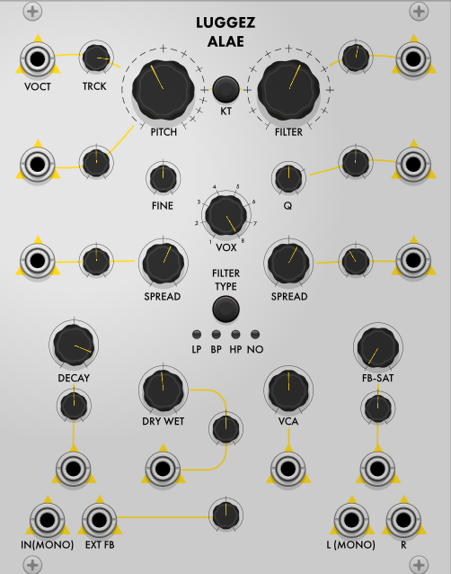

# Alae by Luggez

<table>
  <tr>
    <td>
      
    </td>
    <td>
      

        <b>Alae</b> by Luggez is a VCV Rack plugin module that combines delay effects, Karplus-Strong resonator sounds, and feedback oscillation.
      

      <ul>
        <li>Up to 8 parallel Karplus-Strong delay loops with multimode Biquad filters (lowpass, bandpass, highpass, notch).</li>
        <li>Base frequency for both pitch and filter, with a spread control to adjust pitch and filter frequency for complex timbres.</li>
        <li>Delay time range: 10 seconds to 6 kHz (based on a 48 kHz sample rate, adjusts with different sample rates).</li>
        <li>Interpolation for accurate pitch reproduction, especially at higher frequencies, minimizing audible pitch deviations.</li>
        <li>Decay control adjusts a frequency-dependent feedback factor for a consistent reverb time of up to 60 seconds, regardless of pitch or delay length.</li>
        <li>Feedback Saturation (FB-SAT) control drives the module into self-oscillation, adding overtones as the control is increased.</li>
        <li>Filter bypass allows for custom feedback loops using external audio sources and other VCV Rack modules.</li>
        <li>Pitch tracking correction parameter compensates for variations in pitch tracking due to filter type, frequency, or external feedback loops.</li>
        <li>CV-controllable for all key parameters.</li>
        <li>Right-click menu for adjusting the saturation algorithm, interpolation algorithm, and spread behavior for pitch and filter.</li>
      </ul>
      
For further instructions take a look at the luggez_alae_manual.pdf

    </td>
  </tr>
</table>

Heres a quick sound demo on youtube:  

